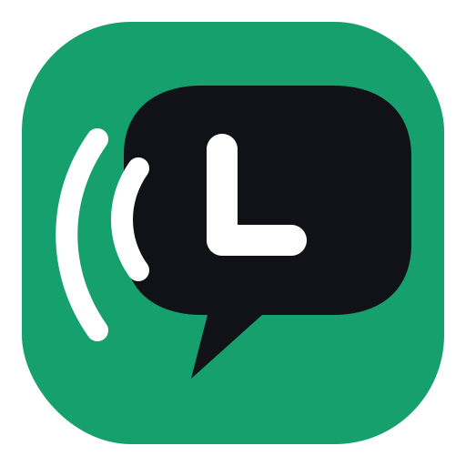

# Loracord


<p align="center">
  
</p>

Loracord is a Discord-like Flutter mobile app for offline Meshtastic LoRa mesh
networks. The phone provides the user interface and application logic, while the
external ESP32/radio node carries packets across the mesh.

Website: https://anarchis12.github.io/Loracord/

APK downloads: https://github.com/AnARCHIS12/Loracord/releases/latest

## Current Features

- Mobile interface with guilds, custom text channels, DMs, invite codes, and local history.
- Native Android BLE transport for Meshtastic nodes.
- Minimal protobuf encoding for Meshtastic `ToRadio` and `FromRadio` messages.
- Meshtastic `PRIVATE_APP` port for Loracord packets.
- Compact binary Loracord protocol with fragmentation and reassembly.
- Loracord AES-GCM 256 application-layer encryption before fragmentation.
- X25519 DM invites for automatic shared-key derivation.
- Store-and-forward history catch-up through compact `syncRequest` packets.
- Android local storage through `SharedPreferences`.
- Android local notifications for incoming messages.

## Run Locally

```sh
flutter run
```

On Android, enable Bluetooth, power on a BLE-visible Meshtastic node, then open
Loracord and use the `Meshtastic` button at the bottom of the channel list.

## GitHub Pages and Releases

The public landing page lives in `docs/`. The `GitHub Pages` workflow publishes
it automatically to:

```text
https://anarchis12.github.io/Loracord/
```

The `Android APK Release` workflow builds the Android APK and attaches it to a
GitHub Release. You can either push a `v*` tag or run the workflow manually with
a tag.

Example:

```sh
git tag v1.0.0
git push origin v1.0.0
```

The GitHub Pages site reads the latest release from `AnARCHIS12/Loracord` and
shows the APK download button automatically.

## Architecture

- `lib/domain`: users, guilds, channels, messages, and local app state.
- `lib/mesh/loracord_protocol.dart`: compact frames, fragmentation, reassembly, and sync packets.
- `lib/mesh/loracord_crypto.dart`: AES-GCM payload encryption and X25519 DM key derivation.
- `lib/mesh/meshtastic_codec.dart`: wraps Loracord frames in `ToRadio` and extracts `PRIVATE_APP` payloads from `FromRadio`.
- `lib/mesh/meshtastic_ble_transport.dart`: Flutter-side BLE transport API.
- `android/.../MainActivity.kt`: native Android BLE scanning, connection, read, and write logic for Meshtastic.
- `lib/app_controller.dart`: orchestration between UI, storage, transport, protocol, and crypto.
- `lib/app.dart`: mobile UI.

## Hardware Notes

Loracord uses the Meshtastic client BLE service UUIDs:

- Service: `6ba1b218-15a8-461f-9fa8-5dcae273eafd`
- FromRadio: `2c55e69e-4993-11ed-b878-0242ac120002`
- ToRadio: `f75c76d2-129e-4dad-a1dd-7866124401e7`
- FromNum: `ed9da18c-a800-4f66-a670-aa7547e34453`

Loracord does not simulate the mesh. Sending is blocked until a real Meshtastic
node is connected.

## Encryption Model

Loracord follows the Meshtastic security model instead of replacing it:

- The Meshtastic radio channel should use a private PSK, ideally `random`.
- The Meshtastic PSK protects LoRa transport between nodes on the same channel.
- Loracord then encrypts the application payload with AES-GCM 256 before placing it in `PRIVATE_APP`.
- `LC2-...` guild invite codes contain the guild's 32-byte Loracord key in hexadecimal.
- DM invites use `LDM-...` with an X25519 public key and automatically derive a shared AES-GCM key.
- A manual 64-hex DM key is still accepted as a fallback.

Legacy `LC-...` codes are still accepted, but they do not carry a shareable
Loracord key. For private guilds, create a new guild to get an `LC2-...` invite.
For private DMs, share the `LDM-...` code shown in the Add DM dialog.
